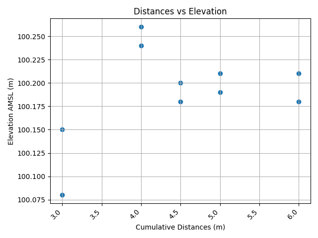

## Changed Code from v3 to GUI

After learning GUI development with PyQt5, I redesigned the CLI-based land measurement tool into a full-featured desktop application.  
This makes the tool more user-friendly and accessible—especially for non-technical users on Windows.

---

## Features

- Mid-thread validation (top, mid, bottom input)
- Automatic elevation & height difference calculation
- Distance input between points
- Auto status labeling: RISE, FALL, FLAT
- Clean tabular results and interactive graphic display
- Export results to:
  - Excel (.xlsx) with embedded graphs
  - CSV file
  - PNG plots: elevation profile, bar chart, scatter plot

---

## How It Works

### Step 1: Welcome
Click **Enter** to start the program  

---

### Step 2: Input Data
Enter the number of measurement points and initial AMSL elevation  

---

### Step 3: Thread Input
Input backsight and foresight readings (top, mid, bottom), and distance between each point  

---

### Step 4: View Results
See the calculated elevations, status, and visual graphs in the interface  

---

### Step 5: Export Results
Export your results to Excel, CSV, and PNG files  

---

## Output Examples

### Excel file (.xlsx)
Contains tabular data + embedded elevation charts  

---

### CSV file (.csv)
Lightweight export for data analysis or record keeping  

---

### PNG files (.png)
Auto-generated graphs:
- Elevation Profile  
  

- Elevation Scatter Plot  
  

- Height Difference Bar Plot  
  

---

## Download App

[LandMeasurementApp v4.0 (Windows ZIP)](https://github.com/Dimas-SP08/Land-Measurement-code/releases/tag/v4.0)

### Steps to Run:

- Click the link above and download the ZIP file
- Extract all contents to a folder
- Double-click LandMeasurementApp.exe to open the app
- Windows SmartScreen Note: If a warning appears:
- Click More Info
- Then click Run Anyway

---  

### Safety & Verification

This app was scanned with VirusTotal:
[VirusTotal Scan Result](https://www.virustotal.com/gui/file/8f3e0b6433442ebce66abc0bc67d497a328c759dc208befc40a443746657a4ed/detection)

Two engines marked it as suspicious, but this is a common false alert for Python apps packaged with PyInstaller.

Why it’s safe:
- It’s a local app with no internet access
- No malicious code or behavior
- Most antivirus engines mark it as clean

To be safe:
- Only download from the official GitHub page
- Match the SHA-256:  
  `8f3e0b6433442ebce66abc0bc67d497a328c759dc208befc40a443746657a4ed`
  
If SmartScreen shows a warning, click “More info” → “Run anyway” after confirming it’s from the correct source.

